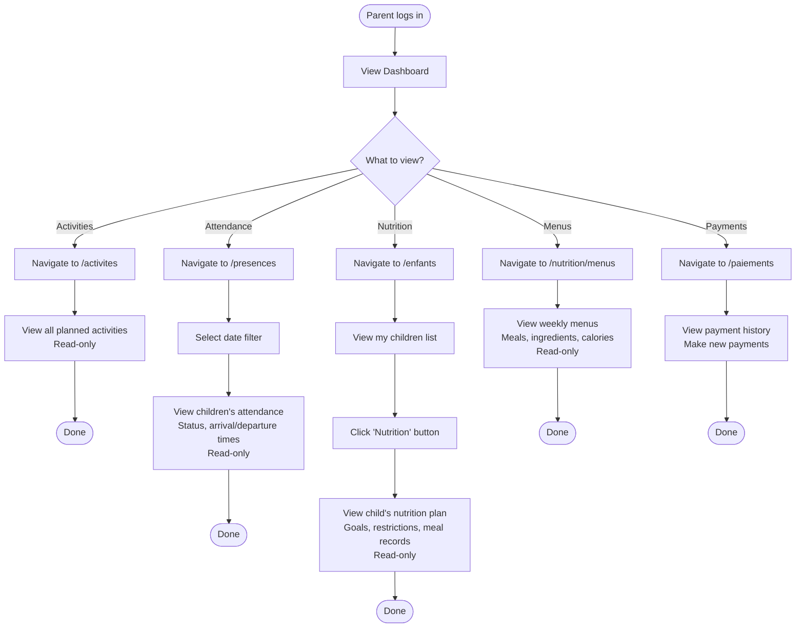

# Activity Diagram: Parent Viewing Child Information

```mermaid
flowchart TD
    Start([Parent logs in]) --> Dashboard[View Dashboard]
    Dashboard --> Choice{What to view?}
    
    Choice -->|Activities| ViewAct[Navigate to /activites]
    ViewAct --> ActList[View all planned activities<br/>Read-only]
    ActList --> End1([Done])
    
    Choice -->|Attendance| ViewPres[Navigate to /presences]
    ViewPres --> PresFilter[Select date filter]
    PresFilter --> PresList["View children's attendance<br/>Status, arrival/departure times<br/>Read-only"]
    PresList --> End2([Done])
    
    Choice -->|Nutrition| ViewChild[Navigate to /enfants]
    ViewChild --> ChildList[View my children list]
    ChildList --> ClickNutr[Click 'Nutrition' button]
    ClickNutr --> NutrPlan["View child's nutrition plan<br/>Goals, restrictions, meal records<br/>Read-only"]
    NutrPlan --> End3([Done])
    
    Choice -->|Menus| ViewMenu[Navigate to /nutrition/menus]
    ViewMenu --> MenuList[View weekly menus<br/>Meals, ingredients, calories<br/>Read-only]
    MenuList --> End4([Done])
    
    Choice -->|Payments| ViewPay[Navigate to /paiements]
    ViewPay --> PayList[View payment history<br/>Make new payments]
    PayList --> End5([Done])
```
