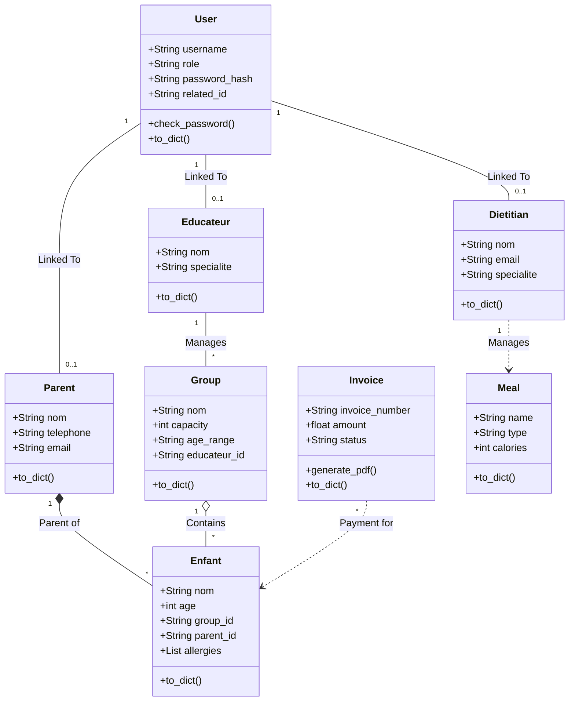

# Class Diagram (Models)

```mermaid
classDiagram
    class User {
        +String username
        +String role
        +String password_hash
        +String related_id
        +check_password()
        +to_dict()
    }

    class Parent {
        +String nom
        +String telephone
        +String email
        +to_dict()
    }

    class Enfant {
        +String nom
        +int age
        +String group_id
        +String parent_id
        +List allergies
        +to_dict()
    }
    
    class Educateur {
        +String nom
        +String specialite
        +to_dict()
    }

    class Dietitian {
        +String nom
        +String email
        +String specialite
        +to_dict()
    }

    class Group {
        +String nom
        +int capacity
        +String age_range
        +String educateur_id
        +to_dict()
    }

    class Invoice {
        +String invoice_number
        +float amount
        +String status
        +generate_pdf()
        +to_dict()
    }

    class Meal {
        +String name
        +String type
        +int calories
        +to_dict()
    }

    User "1" -- "0..1" Parent : Linked To
    User "1" -- "0..1" Educateur : Linked To
    User "1" -- "0..1" Dietitian : Linked To
    
    Parent "1" *-- "*" Enfant : Parent of
    Educateur "1" -- "*" Group : Manages
    Group "1" o-- "*" Enfant : Contains
    Dietitian "1" ..> Meal : Manages
    Invoice "*" ..> Enfant : Payment for
```
