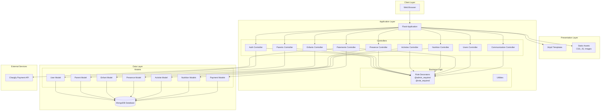

# Component Diagram: System Architecture

```mermaid
graph TB
    subgraph "Client Layer"
        Browser[Web Browser]
    end
    
    subgraph "Presentation Layer"
        Templates[Jinja2 Templates]
        Static[Static Assets<br/>CSS, JS, Images]
    end
    
    subgraph "Application Layer"
        Flask[Flask Application]
        
        subgraph "Controllers"
            AuthC[Auth Controller]
            ParentC[Parents Controller]
            EnfantC[Enfants Controller]
            PresC[Presence Controller]
            ActC[Activites Controller]
            NutrC[Nutrition Controller]
            PayC[Paiements Controller]
            UserC[Users Controller]
            CommC[Communication Controller]
        end
        
        subgraph "Business Logic"
            Decorators[Role Decorators<br/>@admin_required<br/>@role_required]
            Utils[Utilities]
        end
    end
    
    subgraph "Data Layer"
        subgraph "Models"
            UserM[User Model]
            ParentM[Parent Model]
            EnfantM[Enfant Model]
            PresM[Presence Model]
            ActM[Activite Model]
            NutrM[Nutrition Models]
            PayM[Payment Models]
        end
        
        DB[(MongoDB Database)]
    end
    
    subgraph "External Services"
        Chargily[Chargily Payment API]
    end
    
    Browser --> Flask
    Flask --> Templates
    Flask --> Static
    
    Flask --> AuthC
    Flask --> ParentC
    Flask --> EnfantC
    Flask --> PresC
    Flask --> ActC
    Flask --> NutrC
    Flask --> PayC
    Flask --> UserC
    Flask --> CommC
    
    AuthC --> Decorators
    ParentC --> Decorators
    EnfantC --> Decorators
    PresC --> Decorators
    ActC --> Decorators
    NutrC --> Decorators
    PayC --> Decorators
    UserC --> Decorators
    CommC --> Decorators
    
    AuthC --> UserM
    ParentC --> ParentM
    EnfantC --> EnfantM
    PresC --> PresM
    ActC --> ActM
    NutrC --> NutrM
    PayC --> PayM
    
    UserM --> DB
    ParentM --> DB
    EnfantM --> DB
    PresM --> DB
    ActM --> DB
    NutrM --> DB
    PayM --> DB
    
    PayC --> Chargily
```
