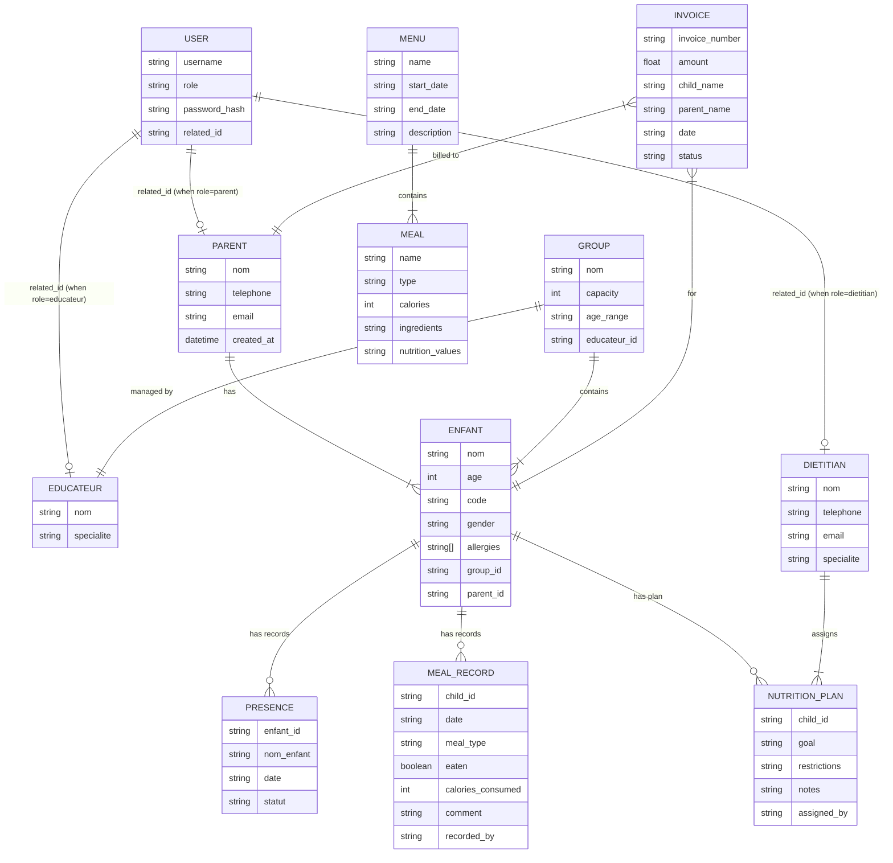

# Entity Relationship Diagram (ERD)

```mermaid
erDiagram
    USER ||--o| PARENT : "related_id (when role=parent)"
    USER ||--o| EDUCATEUR : "related_id (when role=educateur)"
    USER ||--o| DIETITIAN : "related_id (when role=dietitian)"
    
    PARENT ||--|{ ENFANT : "has"
    GROUP ||--|{ ENFANT : "contains"
    GROUP ||--|| EDUCATEUR : "managed by"
    
    ENFANT ||--o{ PRESENCE : "has records"
    ENFANT ||--o{ MEAL_RECORD : "has records"
    ENFANT ||--o{ NUTRITION_PLAN : "has plan"
    
    DIETITIAN ||--|{ NUTRITION_PLAN : "assigns"
    MENU ||--|{ MEAL : "contains"
    
    INVOICE }|--|| PARENT : "billed to"
    INVOICE }|--|| ENFANT : "for"

    USER {
        string username
        string role
        string password_hash
        string related_id
    }

    PARENT {
        string nom
        string telephone
        string email
        datetime created_at
    }

    ENFANT {
        string nom
        int age
        string code
        string gender
        string[] allergies
        string group_id
        string parent_id
    }

    EDUCATEUR {
        string nom
        string specialite
    }

    DIETITIAN {
        string nom
        string telephone
        string email
        string specialite
    }

    GROUP {
        string nom
        int capacity
        string age_range
        string educateur_id
    }

    INVOICE {
        string invoice_number
        float amount
        string child_name
        string parent_name
        string date
        string status
    }

    MEAL {
        string name
        string type
        int calories
        string ingredients
        string nutrition_values
    }

    MENU {
        string name
        string start_date
        string end_date
        string description
    }

    NUTRITION_PLAN {
        string child_id
        string goal
        string restrictions
        string notes
        string assigned_by
    }

    MEAL_RECORD {
        string child_id
        string date
        string meal_type
        boolean eaten
        int calories_consumed
        string comment
        string recorded_by
    }

    PRESENCE {
        string enfant_id
        string nom_enfant
        string date
        string statut
    }
```
