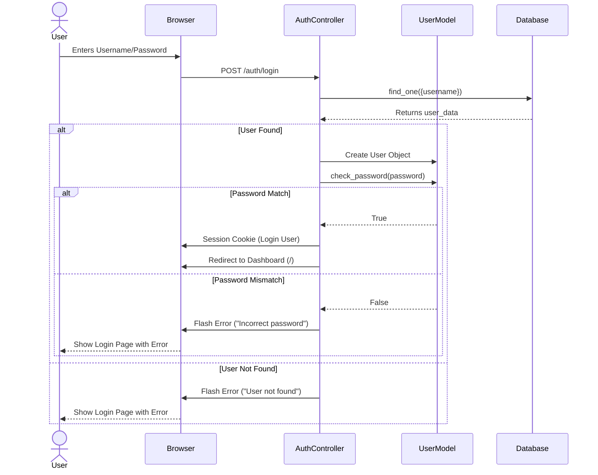

# Login Sequence Diagram

```mermaid
sequenceDiagram
    actor User
    participant Browser
    participant AuthController
    participant UserModel
    participant Database

    User->>Browser: Enters Username/Password
    Browser->>AuthController: POST /auth/login
    AuthController->>Database: find_one({username})
    Database-->>AuthController: Returns user_data
    
    alt User Found
        AuthController->>UserModel: Create User Object
        AuthController->>UserModel: check_password(password)
        
        alt Password Match
            UserModel-->>AuthController: True
            AuthController->>Browser: Session Cookie (Login User)
            AuthController->>Browser: Redirect to Dashboard (/)
        else Password Mismatch
            UserModel-->>AuthController: False
            AuthController->>Browser: Flash Error ("Incorrect password")
            Browser-->>User: Show Login Page with Error
        end
        
    else User Not Found
        AuthController->>Browser: Flash Error ("User not found")
        Browser-->>User: Show Login Page with Error
    end
```
