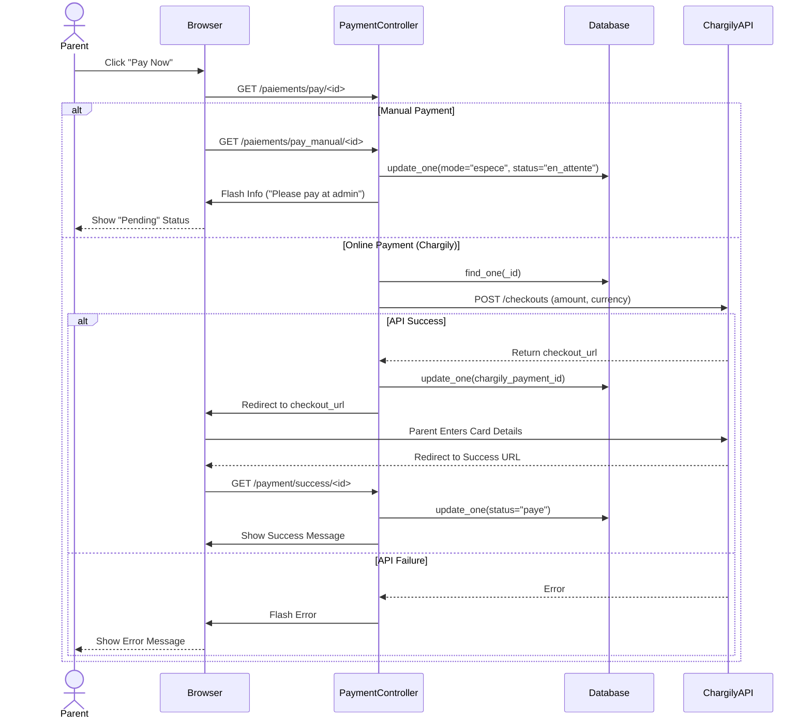

# Payment Sequence Diagram

```mermaid
sequenceDiagram
    actor Parent
    participant Browser
    participant PaymentController
    participant Database
    participant ChargilyAPI

    Parent->>Browser: Click "Pay Now"
    Browser->>PaymentController: GET /paiements/pay/<id>
    
    alt Manual Payment
        Browser->>PaymentController: GET /paiements/pay_manual/<id>
        PaymentController->>Database: update_one(mode="espece", status="en_attente")
        PaymentController->>Browser: Flash Info ("Please pay at admin")
        Browser-->>Parent: Show "Pending" Status
    else Online Payment (Chargily)
        PaymentController->>Database: find_one(_id)
        PaymentController->>ChargilyAPI: POST /checkouts (amount, currency)
        
        alt API Success
            ChargilyAPI-->>PaymentController: Return checkout_url
            PaymentController->>Database: update_one(chargily_payment_id)
            PaymentController->>Browser: Redirect to checkout_url
            Browser->>ChargilyAPI: Parent Enters Card Details
            ChargilyAPI-->>Browser: Redirect to Success URL
            Browser->>PaymentController: GET /payment/success/<id>
            PaymentController->>Database: update_one(status="paye")
            PaymentController->>Browser: Show Success Message
        else API Failure
            ChargilyAPI-->>PaymentController: Error
            PaymentController->>Browser: Flash Error
            Browser-->>Parent: Show Error Message
        end
    end
```
