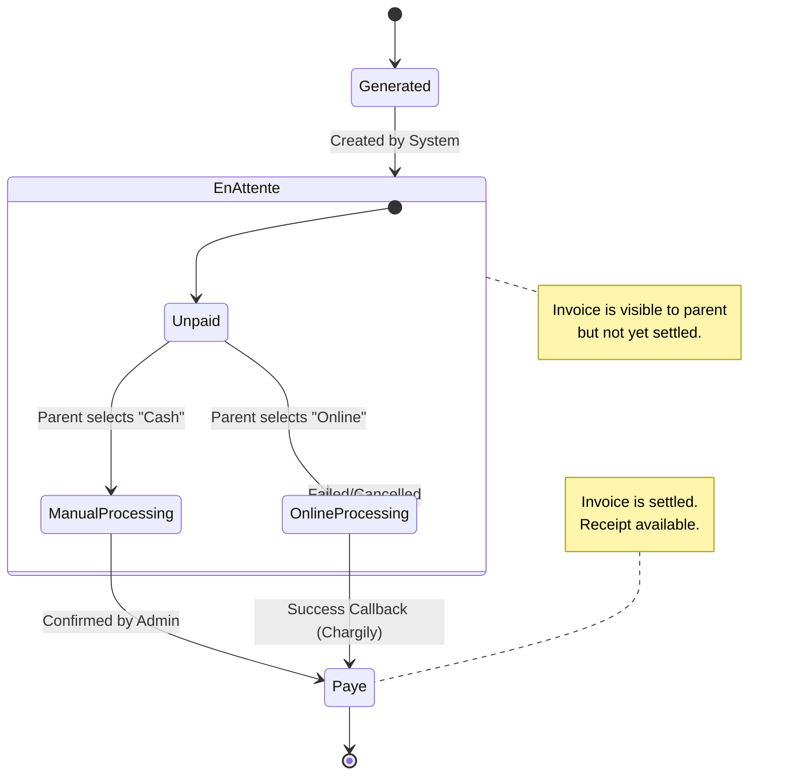

# State Diagram (Invoice Status)

```mermaid
stateDiagram-v2
    [*] --> Generated
    
    Generated --> EnAttente : Created by System
    
    state EnAttente {
        [*] --> Unpaid
        Unpaid --> ManualProcessing : Parent selects "Cash"
        Unpaid --> OnlineProcessing : Parent selects "Online"
    }

    ManualProcessing --> Paye : Confirmed by Admin
    OnlineProcessing --> Paye : Success Callback (Chargily)
    OnlineProcessing --> EnAttente : Failed/Cancelled

    Paye --> [*]
    
    note right of EnAttente
        Invoice is visible to parent
        but not yet settled.
    end note

    note left of Paye
        Invoice is settled.
        Receipt available.
    end note
```
